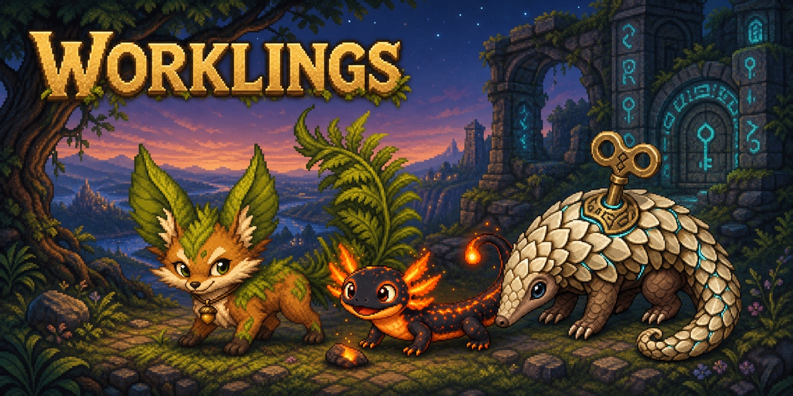
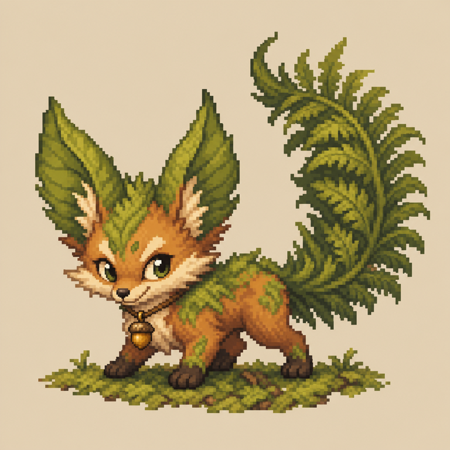
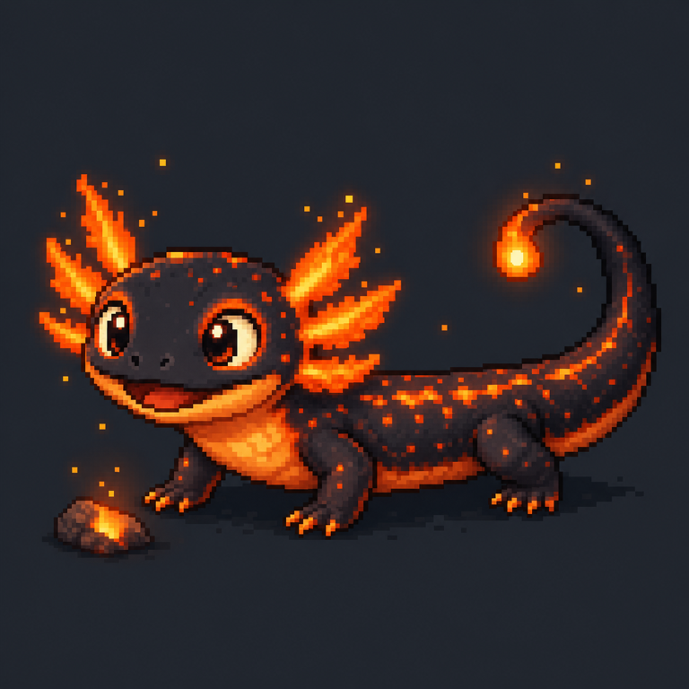
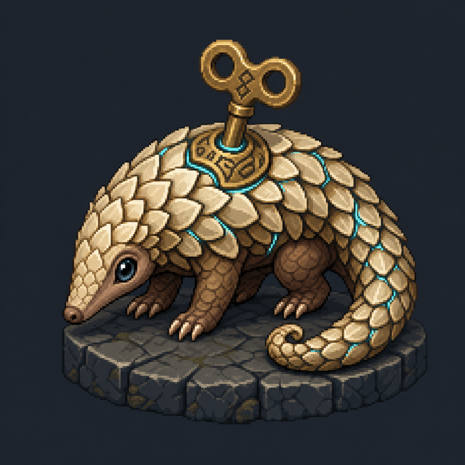

# Worklings

<p align="center">
  
</p>

As an MMO fan whose been itching to find some outlet, I figured having a pet that actually feels like a pet that lives in your computer, but responds to stimuli from your actions, rather than some superficial toy was in order. Think of a pet that will level up as you complete tasks and do work. Levels come with stat points, build trees, ability to quest, gear, etc...  THe sky is the limit, but we'll see. I'm also keen on multiplayer at some point. We're so early! 

The rest of this readme has been written by AI, but read and edited by me wherever necessary

Worklings is an experimental macOS desktop pet inspired by the persistence, progression, and attachment of an MMO character. It is meant to feel like a small living creature rather than another status widget. The immediate step is to get a Workling to react to Codex activity, but the longer-term goal is broader: a private, local pet that can react to work across IDEs, agents, and other explicitly connected applications. Each Workling has its own needs, preferences, moods, and routines, and its behavior should remain meaningful even when no integration is active.

What remains to be decided is whether or not the pet will be context general-context aware or only where its connected to specific apps. (Easier to do in the world of agentic engineering, but harder when looking at broader knowledge work tasks.)

To keep track of the progress, you can see the /docs/changelog.md - this will have all the stuff we've added over the dev cycle.

## What we are building

Worklings combines three ideas:

- **A living pet:** hunger, energy, happiness, trust, preferences, reactions, and reversible neglect.
- **A respectful desktop presence:** a floating companion that can be moved, tucked away, and eventually roam without obstructing work.
- **Provider-neutral activity awareness:** Codex is the first planned activity source, but the Pet Brain consumes generic activity events rather than Codex-specific state.

The project is macOS-first and implemented in Swift with SwiftUI and AppKit. Pet state is processed and stored locally. Keystrokes, screen contents, prompts, and source code are outside the default data model.

## Character direction

Worklings may eventually come from several creature families. These early concepts establish three directions that can coexist as the world grows:

| Wildkin | Elemental | Relicborn |
| --- | --- | --- |
|  |  |  |
| A moss-fox shaped by living woodland magic. | An ember-newt whose elemental nature is part of its anatomy. | A keyback pangolin bonded to an ancient rune-powered relic. |

All three families use the same twelve-frame pose contract and are selectable at runtime from the menu bar.

## Current state

The current experimental build includes:

- a transparent floating companion window;
- a persistent menu-bar choice between Wildkin, Elemental, and Relicborn appearances;
- shared pixel-art smoke transitions for launch, wake, tuck-away, and family changes;
- optional single-display idle roaming with walking frames and a persistent pause control;
- internal hunger presented as Fullness, plus energy, happiness, and trust;
- favourite food and play preferences;
- deterministic time progression and capped offline progression;
- versioned local JSON persistence;
- automatic copy-forward of a legacy Build Companion save;
- hover summaries for relevant needs;
- a clickable care card with Feed, Play, Pet, and Sleep actions;
- menu-bar wake, tuck-away, care, and quit controls;
- Worklings-branded app, DMG, checksum, and release-verification scripts;
- dependency-free behavioral checks for simulation, persistence, presentation, care status, and window placement.

Pixel defaults to the moss-fox Wildkin for existing saves, while users can switch immediately to the ember-newt Elemental or keyback pangolin Relicborn without resetting care progress. A full adoption flow, mood-driven movement, richer personality, activity integrations, and the first Worklings-branded public release remain in development.

## Use from the repository

### Requirements

- macOS 14 or newer;
- Apple Command Line Tools or Xcode;
- Swift 6-compatible toolchain;
- Git.

Clone and enter the repository:

```bash
git clone git@github.com:Bingeljell/worklings.git
cd worklings
```

Run Worklings:

```bash
swift run Worklings
```

The first build may take a moment. Pixel appears as a floating desktop companion and adds a paw icon to the menu bar.

### Interacting with Pixel

- Hover over Pixel for a short natural-language status summary.
- Click Pixel to open the care card.
- Drag Pixel to reposition it without opening the card.
- Use Feed, Play, Pet, and Sleep to affect its needs.
- Use the paw menu to inspect state, tuck Pixel away, wake it, or quit.
- Use **Let Pixel Roam** in the paw menu to opt into idle movement; pause it from the same control.
- Press `Control+C` in the launching terminal to stop the process directly.

Pet state is stored under the current user's `Application Support/Worklings` directory and restored on the next launch. On the first launch after upgrading from Build Companion, Worklings copies the existing save forward and preserves the legacy copy.

## Build and verify

Build every target:

```bash
swift build
```

Run the dependency-free behavioral checks:

```bash
swift run CompanionCoreChecks
```

The check runner is used because a minimal Apple Command Line Tools installation may not include XCTest or Swift Testing.

## Beta application download

Experimental DMG builds are published through [GitHub Releases](https://github.com/Bingeljell/worklings/releases) when a tested version is available. The initial packaging target is Apple Silicon (`arm64`) running macOS 14 or newer.

The current prerelease is [`v0.1.0-alpha.2`](https://github.com/Bingeljell/worklings/releases/tag/v0.1.0-alpha.2), the first Worklings-branded DMG. The older `v0.1.0-alpha.1` prerelease predates the rename and still downloads Build Companion.

To install a packaged alpha:

1. Download the `.dmg` and matching `.dmg.sha256` files from the release.
2. Optionally verify the download from the directory containing both files:

   ```bash
   shasum -a 256 --check Worklings-<version>-macos-arm64.dmg.sha256
   ```

3. Open the DMG and drag **Worklings** to the **Applications** shortcut.
4. Eject the disk image.
5. Because the experimental alpha is ad-hoc signed rather than Apple-notarized, open the app from Finder's context menu and confirm **Open**. If macOS still blocks it, use **System Settings > Privacy & Security > Open Anyway**.

Do not disable Gatekeeper globally. Developer ID signing and Apple notarization are planned when the project is ready for a broader non-technical beta.

For the first upgrade from Build Companion, quit the old app and install Worklings alongside it. Launch Worklings once and confirm that Pixel's state was copied forward before removing the old application. Subsequent Worklings releases can replace `Worklings.app` normally.

## Project direction

Near-term work focuses on tuning the care loop, safe roaming, and desktop interaction. Later milestones include:

- intent-driven walking, resting, and attention-seeking;
- richer needs, routines, preferences, and recoverable neglect;
- Codex lifecycle reactions through documented integration points;
- adapters for other IDEs and agents;
- additional species, adoption, and richer animation states;
- a Worklings-branded prerelease followed later by Developer ID signing and notarization.

## Documentation

- [Product brief](docs/product_brief.md)
- [Architecture](docs/architecture.md)
- [Pet Brain](docs/pet_brain.md)
- [Progression design](docs/progression.md)
- [Pet interaction model](docs/pet_interaction.md)
- [Beta distribution](docs/distribution.md)
- [Git workflow](docs/git_workflow.md)
- [Contributing](CONTRIBUTING.md)
- [Security policy](SECURITY.md)
- [Code of Conduct](CODE_OF_CONDUCT.md)
- [Changelog](docs/changelog.md)

## License

Worklings source code is available under the [Apache License 2.0](LICENSE). In practical terms, the license permits use, modification, and redistribution—including commercial use—subject to its notice and attribution conditions, and includes an explicit patent grant from contributors.

Unless a file or asset states otherwise, the first-party visual assets in this repository—including concept art and runtime sprite artwork—are covered by the same license. Future pet artwork or third-party asset packs may declare separate terms alongside those assets; they will not silently change the license of the source code.

## Contributing

Pull requests are welcome. Worklings is still experimental, so focused changes that preserve the product principles are easier to review and merge than broad rewrites.

See [CONTRIBUTING.md](CONTRIBUTING.md) for the complete development workflow, design boundaries, and pull request acceptance criteria.

Before starting a change that introduces a dependency, changes persistence compatibility, expands data collection, or materially changes product direction, open a GitHub issue to discuss the tradeoffs first.

### Minimum quality for a pull request

Every PR should:

- build successfully with `swift build`;
- pass all behavioral checks with `swift run CompanionCoreChecks`;
- add or update checks for changed domain, persistence, placement, or presentation behavior;
- include manual verification notes for AppKit or SwiftUI interaction changes;
- update `docs/changelog.md` using the repository's existing entry format;
- update relevant documentation when behavior or architecture changes;
- preserve local-first privacy boundaries and avoid collecting user content by default;
- preserve accessibility behavior, including keyboard access and Reduce Motion where applicable;
- preserve existing save files or include an explicit, tested migration strategy.

Keep PRs scoped to one coherent outcome. The description should explain the user problem, the chosen approach, important tradeoffs, and exactly how the change was tested. Screenshots or a short recording are encouraged for visible interface changes.

External contributors may use their normal Git workflow in a fork. Maintainer and agent commits in this repository follow [the project Git workflow](docs/git_workflow.md).

Unless explicitly stated otherwise, contributions submitted for inclusion are accepted under the project's [Apache License 2.0](LICENSE).

Worklings is currently an experiment. Interfaces, save formats, behavior rates, and visual presentation may change while the core experience is being validated.
