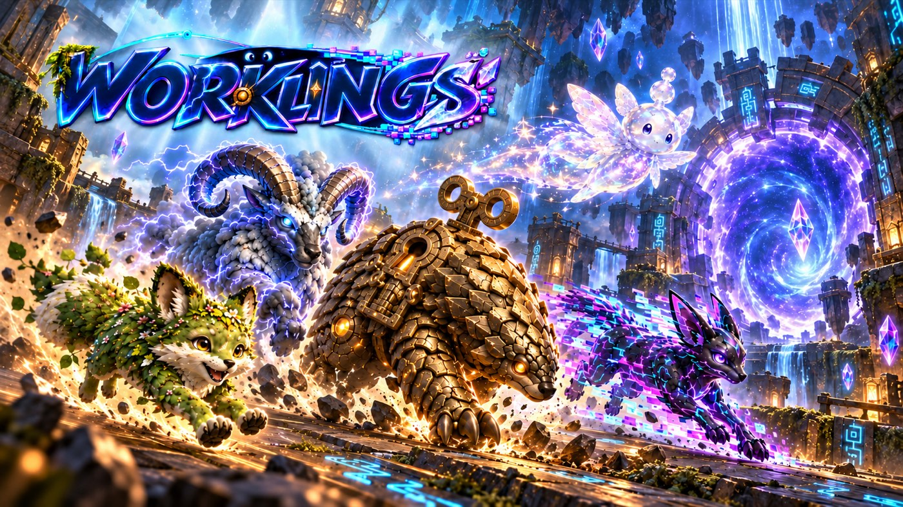

# Worklings

<p align="center">
  
</p>

As an MMO fan whose been itching to find some outlet, I figured having a pet that actually feels like a pet that lives in your computer, but responds to stimuli from your actions, rather than some superficial toy was in order. Think of a pet that will level up as you complete tasks and do work. Levels come with stat points, build trees, ability to quest, gear, etc...  THe sky is the limit, but we'll see. I'm also keen on multiplayer at some point. We're so early! 

The rest of this readme has been written by AI, but read and edited by me wherever necessary

Worklings is an experimental macOS desktop pet inspired by the persistence, progression, and attachment of an MMO character. It is meant to feel like a small living creature rather than another status widget. The immediate step is to get a Workling to react to Codex activity, but the longer-term goal is broader: a private, local pet that can react to work across IDEs, agents, and other explicitly connected applications. Each Workling has its own needs, preferences, moods, and routines, and its behavior should remain meaningful even when no integration is active.

What remains to be decided is whether or not the pet will be context general-context aware or only where its connected to specific apps. (Easier to do in the world of agentic engineering, but harder when looking at broader knowledge work tasks.)

To keep track of the progress, you can see the [changelog](docs/changelog.md) - this will have all the stuff we've added over the dev cycle.

## What's new

**The dungeon became a game you play, and the whole thing runs on Godot now.**

- **⚔️ A move every round.** Combat used to pick a standing stance — Aggressive, Careful, Clever — and resolve itself while you watched. Now you press a verb each round: **Strike**, **Brace**, or your once-per-fight **Signature**. What you press is what your Workling does. The stances are gone; they read as odd in play and they lied by omission, since "Careful" meant *brace if hurt* and could answer your press with a swing.
- **👁️ The foe tells you what it's about to do.** Its move is decided at the top of the round and shown as an icon over its head — **Attacking**, **Winding up**, **Heavy slam**, **Grasping**, **Blur strike** — with a hover tooltip explaining it. It is then bound to that declaration. So bracing the Monolith's slam is a decision instead of a coin flip: the same blow lands for 28 unbraced and 13 braced.
- **⏱️ One countdown per move.** The foe declares → you answer → 3-2-1 → both moves play, your Workling always first. What just happened is spelled out under the fight *after* the blow lands, not before it.
- **🎮 Godot.** The engine is now Godot 4 with C#, replacing SwiftUI/AppKit for the pet, the arena, and everything in between. Worklings are **live 3D characters** authored in Blender rather than pixel-art sprites — five bodies with real attack, wince and death animations, on a lit stage (the Moonlit Ruins) with impact frames, camera shake, ghost trails and per-creature signature effects.
- **🗺️ The delve, end to end.** A briefing, a **loadout** you pack before descending, a four-encounter chain through the Cache Warren, and a **bank-or-push** prompt after every win. Every cleared encounter drops gear; only the mini-boss carries **Prime**.
- **🎒 Gear.** Three functional slots — **Tool**, **Ward**, **Charm** (never a human armour paper-doll; Worklings are creatures) — and fifteen items across three tiers. Items are universal with a soft **family attunement** rider, folded into your stats at read-time so gear never rewrites what you've earned.
- **🔊 Combat audio.** A dungeon soundtrack, a separate boss theme, per-action cues, and a victory fanfare, behind a mute toggle and a volume slider.
- **🔌 Works with your tools.** Reacts to real work through **Claude Code** and **Codex** (live) and **local Git commits** — all content-free (no code, prompts, or keystrokes ever leave your machine).

## What we are building

Worklings combines three ideas:

- **A living pet:** hunger, energy, happiness, trust, preferences, reactions, and reversible neglect.
- **A respectful desktop presence:** a floating companion that can be moved, tucked away, and eventually roam without obstructing work.
- **Provider-neutral activity awareness:** Codex is the first planned activity source, but the Pet Brain consumes generic activity events rather than Codex-specific state.

The project is macOS-first and built in **Godot 4 with C#**. It began as a Swift/SwiftUI app; the rules engine was ported to C# and the presentation rebuilt in Godot when the pet and the dungeon both needed real 3D. The Swift app has been removed; the last commit that has it is tagged `swift-final`. The app is `godot/worklings`. Pet state is processed and stored locally. Keystrokes, screen contents, prompts, and source code are outside the default data model.

## Character direction

The Art here is now stale and we'll be updating it to match the actual game and the cover image. But the concept remains. 
Worklings come from five creature families across five thematic lanes — nature, elements, machinery, energy, and cosmos. Three have art today (below); **Glitchkin** (energy) and **Bloomglass** (cosmos) are the two newest and still design-stage. The full cosmetic critter catalogue lives in the [race & creature roster](docs/design/worklings_race_creature_roster.md).

| Wildkin | Elemental | Relicborn |
| --- | --- | --- |
|  |  |  |
| A moss-fox shaped by living woodland magic. | An ember-newt whose elemental nature is part of its anatomy. | A keyback pangolin bonded to an ancient rune-powered relic. |

The concept art above is the **input** to the pipeline, not the shipped look: each design is modelled and rigged in Blender, then exported to glTF as a live 3D body. Five bodies exist today; adding another is one entry in the creature roster.

## Classes

Class is the primary mechanical axis: every Workling levels up from real activity, and its class decides which stat grows fastest. Family is **soft-coupled** to class — each family leans slightly toward one class and away from another (via a small stat lean and a passive), but any family can still be any class. Each class name is dual-coded: a term with real currency in modern work/maker culture that also carries its own mythic weight.

| Class | Signature stat | Role | Flavor |
| --- | --- | --- | --- |
| **Wellspring** | Vitality | Healer / Support | The source others draw on — sustains, restores, never runs dry. |
| **Juggernaut** | Power | Heavy offense | Hits like an unstoppable force — raw, overwhelming offense. |
| **Aegis** | Guard | Tank | The shield everyone stands behind — mitigates, endures, protects. |
| **Maverick** | Agility | Finesse offense | Moves fast, breaks convention — quick, decisive, takes the opening first. |
| **Tinkerer** | Wit | Mage-equivalent | Technology so advanced it might as well be magic — clever, inventive, otherworldly effective. |

Classes are freely swappable for now; once abilities and gear exist, changing class will become a more deliberate choice. Families, species, and the class roster all live in the [character compendium](docs/design/characters.md).

## Current state

The current experimental build includes:

- a transparent floating companion window with a menu-bar paw;
- **live 3D Workling bodies** — Tempest Ram, Key-back Pangolin, Dungeon Scamp, Forest Flicker, Snag — authored in Blender and exported to glTF;
- internal hunger presented as Fullness, plus energy, happiness, and trust, with favourite food and play preferences;
- deterministic time progression, capped offline progression, and versioned local JSON persistence;
- a Character Screen — gear slots, stats, inventory, and Feed, Play, Pet, and Sleep;
- XP, levels, and five class-weighted stats earned from care and real work activity;
- **the Cache Warren**: a four-encounter delve with per-round moves, declared foe intents, gear drops, and bank-or-push;
- activity awareness through Claude Code, Codex, and local Git commits;
- Worklings-branded app, DMG, checksum, and release-verification scripts;
- dependency-free headless probes for combat, persistence, progression, care, placement, and the delve chain.

A full adoption flow, mood-driven movement, richer personality, and party combat remain in development.

## How to play

### The pet

Your Workling lives on the desktop. Hover it for a status summary, click it to open its Character Screen, and drag it to reposition. Feed, Play, Pet, and Sleep affect its needs; the paw menu holds wake, tuck-away, care, and quit.

It earns XP from real work — commits, and activity from Claude Code and Codex once connected — which is what levels it and grows its stats.

### The delve

Enter the Cache Warren from the paw menu. A run is four encounters deep and you may leave after any win.

**Prep.** Pick the Workling you're descending as and one item per slot. `↑↓` moves between lines, `←→` changes the selection, `Enter` descends.

**The fight.** Each round runs the same way:

1. **The foe declares.** An icon appears over its head saying what it will do this round. Hover it for the detail.
2. **You choose.** Press `1` **Strike**, `2` **Brace**, or `3`/`U` **Unleash** your Signature — once per fight. `Space` repeats your last move. The buttons are clickable too.
3. **3-2-1**, then both moves play — yours first, always.

Reading the intent is the whole game. A **Heavy slam** is guaranteed to hit and roughly doubles the damage, so brace it — bracing halves the blow and mends a little. A **Winding up** foe does not attack at all that round, so it is a free hit: strike, or spend your Signature. **Grasping** dulls your Agility for a few rounds. A **Blur strike** means the foe over-extends and opens a window.

**Bank or push.** After each win: `Space` to push deeper, `B` to bank and leave. Every cleared encounter drops gear, but only the mini-boss carries Prime — and your HP carries between fights, which is what makes pushing a gamble.

| Key | Does |
| --- | --- |
| `1` | Strike |
| `2` | Brace — halve the incoming blow, mend a little |
| `3` or `U` | Unleash your Signature (once per fight) |
| `Space` | Repeat your last move · push deeper at the bank prompt |
| `B` | Bank and leave |
| `↑↓ ←→ Enter` | Navigate the prep screen |

## Use from the repository

### Requirements to build from source

**None of this is needed to run a downloaded release** — see [Beta application
download](#beta-application-download) below. The Godot engine and the .NET
runtime ship *inside* the app bundle, which is most of why it weighs 87 MB.
A tester needs macOS 14 and nothing else.

To work on the code, though:

- macOS 14 or newer;
- [Godot 4.7+ **.NET/mono** build](https://godotengine.org/download) — the plain build cannot run C#;
- the .NET 8 SDK;
- Git.

Clone and enter the repository:

```bash
git clone git@github.com:Bingeljell/worklings.git
cd worklings
```

Run the pet:

```bash
scripts/godot-pet
```

Play the dungeon on its own, against a throwaway Workling so your real save is never touched:

```bash
scripts/godot-dungeon           # normal pacing
scripts/godot-dungeon --fast    # a whole delve in under a minute
```

Pet state is stored under the current user's `Application Support/Worklings` directory and restored on the next launch. **Only the packaged app writes that file** — the scripts above use a scratch copy, which is deliberate: a test run has no business near your real Workling.

## Build and verify

Build the C# project:

```bash
dotnet build godot/worklings
```

Run the headless probes and diff each against its stored reference:

```bash
scripts/godot-probe             # every probe that has a reference
scripts/godot-probe persistence # just that one
```

The probes are dependency-free and run without a renderer, which is the point: the combat rules, persistence, progression and delve chain stay verifiable without a window. `tools/FightProbe` prints every round of four fights across all four foe archetypes.

Photograph the dungeon at the moments it changes state — about sixty labelled PNGs for a whole delve, rather than a blind frame every N:

```bash
WORKLINGS_SAVE=/tmp/pet.json WORKLINGS_BEAT_OUT=/tmp/beats \
  godot --path godot/worklings res://tools/beat_shot.tscn
```

Package a release:

```bash
scripts/godot-export --version 0.1.0-alpha.12
scripts/build_dmg --version 0.1.0-alpha.12
```

## Beta application download

Experimental DMG builds are published through [GitHub Releases](https://github.com/Bingeljell/worklings/releases) when a tested version is available. The packaging target is Apple Silicon (`arm64`) running macOS 14 or newer. **That is the whole requirement** — the app carries its own engine and runtime, so there is no Godot install, no .NET install, and nothing to configure.

`v0.1.0-alpha.12` is the current release: the app's own icon, and a download roughly half the size of the one before it after the Intel engine and runtime were stripped out of the bundle. [`v0.1.0-alpha.11`](https://github.com/Bingeljell/worklings/releases/tag/v0.1.0-alpha.11) was **the first release built on Godot** rather than the Swift app: a move every round, foes that declare their intent, and live 3D bodies. [`v0.1.0-alpha.10`](https://github.com/Bingeljell/worklings/releases/tag/v0.1.0-alpha.10) was the last Swift build — the delve made properly playable, with gear you keep and a way out of a cleared Warren. Earlier alphas remain on the releases page; `v0.1.0-alpha.1` predates the rename and still downloads Build Companion.

To install a packaged alpha:

1. Download the `.dmg` and matching `.dmg.sha256` files from the release.
2. Optionally verify the download from the directory containing both files:

   ```bash
   shasum -a 256 --check Worklings-<version>-macos-arm64.dmg.sha256
   ```

3. Open the DMG and drag **Worklings** to the **Applications** shortcut.
4. Eject the disk image.
5. Because the experimental alpha is ad-hoc signed rather than Apple-notarized, open the app from Finder's context menu and confirm **Open**. If macOS still blocks it, use **System Settings > Privacy & Security > Open Anyway**.

Do not disable Gatekeeper globally. Developer ID signing and Apple notarization are planned when the project is ready for a broader non-technical beta.

The Godot build reads and writes the same save file the Swift build did, so a Workling carries forward across the engine change. It is still worth copying `~/Library/Application Support/Worklings/pet-state.json` somewhere safe before the first launch of a new engine's build.

## Project direction

Near-term work focuses on tuning the care loop, safe roaming, and desktop interaction. Later milestones include:

- a turn indicator on your own Workling, and per-attack sound effects;
- a paper-doll loadout screen with item icons instead of the current text grid;
- party combat — more than one Workling on the stage at a time;
- ability trees and per-class item sets;
- richer needs, routines, preferences, and recoverable neglect;
- adapters for more IDEs and agents;
- additional creature families — Glitchkin and Bloomglass are designed, not yet modelled;
- Developer ID signing and notarization once the experiment justifies it.

Known rough edges are tracked in the [dungeon polish backlog](docs/process/dungeon-polish-backlog.md).

## Documentation

- [Product brief](docs/product-brief.md)
- [Architecture](docs/engineering/architecture.md)
- [Pet Brain](docs/design/pet-brain.md)
- [Progression design](docs/design/progression.md)
- [Pet interaction model](docs/design/interaction.md)
- [Beta distribution](docs/process/distribution.md)
- [Dungeon polish backlog](docs/process/dungeon-polish-backlog.md)
- [Git workflow](docs/process/git-workflow.md)
- [Contributing](CONTRIBUTING.md)
- [Security policy](SECURITY.md)
- [Code of Conduct](CODE_OF_CONDUCT.md)
- [Changelog](docs/changelog.md)

## License

Worklings source code is available under the [Apache License 2.0](LICENSE). In practical terms, the license permits use, modification, and redistribution—including commercial use—subject to its notice and attribution conditions, and includes an explicit patent grant from contributors.

Unless a file or asset states otherwise, the first-party visual assets in this repository—including concept art, 3D models, and runtime artwork—are covered by the same license. Future pet artwork or third-party asset packs may declare separate terms alongside those assets; they will not silently change the license of the source code.

## Contributing

Pull requests are welcome. Worklings is still experimental, so focused changes that preserve the product principles are easier to review and merge than broad rewrites.

See [CONTRIBUTING.md](CONTRIBUTING.md) for the complete development workflow, design boundaries, and pull request acceptance criteria.

Before starting a change that introduces a dependency, changes persistence compatibility, expands data collection, or materially changes product direction, open a GitHub issue to discuss the tradeoffs first.

### Minimum quality for a pull request

Every PR should:

- build successfully with `dotnet build godot/worklings`;
- pass all headless probes with `scripts/godot-probe`;
- add or update probes for changed combat, persistence, placement, or presentation behavior;
- include manual verification notes for interaction changes, and a capture for visual ones;
- update `docs/changelog.md` using the repository's existing entry format;
- update relevant documentation when behavior or architecture changes;
- preserve local-first privacy boundaries and avoid collecting user content by default;
- preserve accessibility behavior, including keyboard access and Reduce Motion where applicable;
- preserve existing save files or include an explicit, tested migration strategy.

Keep PRs scoped to one coherent outcome. The description should explain the user problem, the chosen approach, important tradeoffs, and exactly how the change was tested. Screenshots or a short recording are encouraged for visible interface changes.

External contributors may use their normal Git workflow in a fork. Maintainer and agent commits in this repository follow [the project Git workflow](docs/process/git-workflow.md).

Unless explicitly stated otherwise, contributions submitted for inclusion are accepted under the project's [Apache License 2.0](LICENSE).

Worklings is currently an experiment. Interfaces, save formats, behavior rates, and visual presentation may change while the core experience is being validated.
