# The Ribbon Mesh

## How two days of chasing a 3D generation bug ended at one line of cleanup code

**Date:** 2026-08-11
**Repos:** `image-to-3dlab` (the pipeline), `worklings` (the game consuming the assets)
**Outcome:** a six-line fix that took the defect from 40.9% to 8.9%

---

## 1. The problem

We generate 3D models from a single piece of concept art using **TRELLIS.2**, running locally on Apple Silicon. The subject was **Snag**, a "thorn-knot" creature: a mass of woody roots coiled and braided around one another, with a single amber eye buried in the tangle.


In the source art the roots are continuous wood-grain tubes, coiling over and under each other. What came out of the pipeline was something else — a surface that looked like cracked plates. Loose flat shards, flaps peeling off, floating triangles, and gaps you could see straight through.

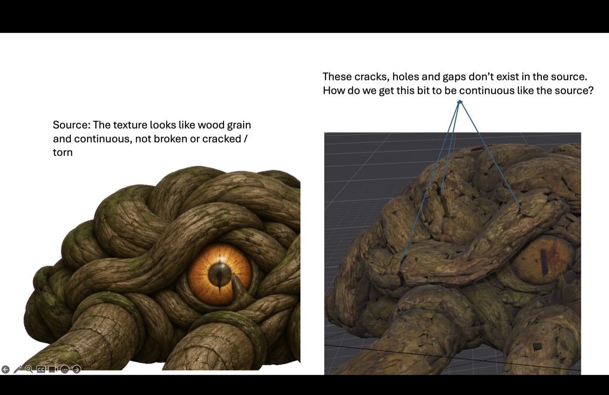

Stripping every texture off and rendering in plain grey confirmed it was **geometry, not texture**. The mesh itself was broken.

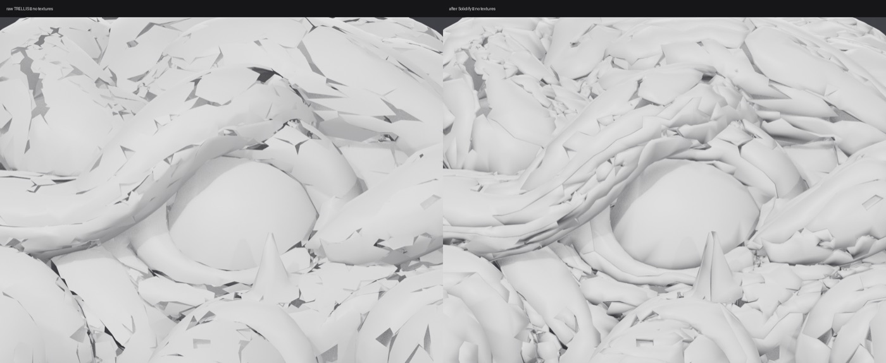

The raw numbers on the shipped asset:

| metric | value |
|---|---|
| faces | 97,707 |
| separate components | 664 |
| boundary (open) edges | 46,253 |
| non-manifold edges | 510 |
| watertight | no |
| winding | inconsistent |

---

### A glossary, because the rest of this needs it

- **Mesh** — a 3D model as a set of triangles ("faces") joined at corners ("vertices").
- **Boundary edge / open edge** — a triangle edge with only *one* triangle attached. In a sealed object every edge has exactly two. An open edge is the rim of a hole.
- **Watertight** — no holes. You could fill it with water.
- **Non-manifold edge** — an edge where three or more triangles meet. Physically impossible for a real surface, and it breaks most downstream tools.
- **Decimation / simplification** — reducing triangle count while keeping the shape. Usually **QEM edge collapse**: repeatedly pick the edge whose removal changes the shape least, and merge its two endpoints into one.
- **Welding** — merging vertices that sit at the same position but are stored as separate points. Visually identical before and after; topologically very different.
- **Flat vs smooth shading** — flat gives every triangle one normal, so you see facets. Smooth blends normals across triangles so curved surfaces look curved. *This distinction turns out to matter enormously.*

---

## 2. The pipeline, in the order things happen

Understanding where the bug lived requires knowing the stages:

1. **Sparse structure** — the model decides *where there is material at all*, on a coarse 3D grid. Think LEGO studs. This stage decides topology: what is connected to what.
2. **Structured latent (SLat)** — it sculpts detail inside that blockout.
3. **Mesh extraction** — a **FlexiCubes** decoder turns the field into actual triangles. Output here: **12,943,043 vertices / 27,623,370 faces**.
4. **`fast_simplification`** — a first decimation pass in the Mac port.
5. **`to_glb`** — the export stage. Runs a twelve-step cleanup chain, then UV unwraps, then bakes textures.

Stage 5 is where the bug was. It took us two days to look there, because we spent the first day and a half convinced the problem was in stages 1–3.

---

## 3. Three wrong diagnoses

### Wrong hypothesis 1: "the model can't represent this subject"

The first theory — mine — was that Snag was simply too dense for the model. Roughly twenty thin tubes braided into one bounding box, on a coarse grid, means each tube is only a few cells across. Where two tubes are closer than one cell, the surface-extraction step gets an ambiguous signal and produces sign-flip artefacts: exactly the orphan flaps we were seeing.

It was a coherent story. The shards *were* densest where the coils packed tightest. It was also wrong, and it produced the next two days of wasted effort.

The recommendation that came out of it — restore TRELLIS's decode-time **visibility cull** — was implemented and failed.

### Wrong hypothesis 2: "cull the junk away"

A **visibility cull** renders the mesh from hundreds of cameras arranged around it, notes which triangles are ever seen from outside, and deletes the rest. It's the standard tool for removing interior garbage, and crucially it's *topology-preserving* — it can't accidentally fuse two nearby coils, because it never asks about proximity.

Built and run at 400 views:

| pass | result |
|---|---|
| 400 views @ 1024px | 91,209 of 97,707 faces visible — culled 6,498 |
| 400 views @ 2048px | 94,089 visible — culled 3,618 |
| plus small-component cull | a further 16,622 faces in 2,532 components |
| **total removed** | **20,240 faces (21%)** |

The render was essentially unchanged. And the mesh got *worse* on paper — components 664 → 696, boundary edges 46,253 → 49,771 — because deleting faces opens new holes.

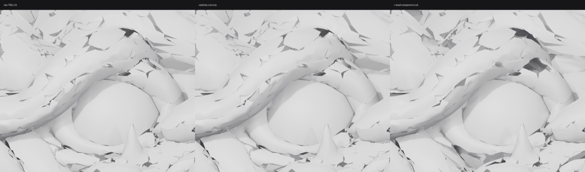

The reason, in hindsight, is embarrassingly simple: **anything visible in a render is by definition seen by a visibility cull.** The shards were plainly visible. A caveat I'd written as a footnote — *"it won't remove an outward-facing flap floating just above the surface"* — turned out to be the entire outcome.

### Wrong hypothesis 3: "the blockout grid is too coarse"

Digging into the pipeline source turned up something that looked damning:

```python
# trellis2_image_to_3d.py:609
ss_res = {'512': 32, '1024': 64, '1024_cascade': 32, '1536_cascade': 32}[pipeline_type]
```

```python
# trellis2_image_to_3d.py:296-298
decoded = decoder(z_s) > 0
if resolution != decoded.shape[2]:
    ratio = decoded.shape[2] // resolution
    decoded = torch.nn.functional.max_pool3d(decoded.float(), ratio, ratio, 0) > 0.5
```

The blockout model's native output is **64³**. Three of the four quality modes then `max_pool3d` it down to **32³**, discarding seven of every eight cells — and `max_pool` marks a coarse cell occupied if *any* of its eight children is, which is precisely the operation that welds two nearby coils into one blob.

Snag's manifest used `1024_cascade`, whose blockout is 32³. It fit perfectly. It even explained why the same setting produced beautiful results on a simpler asset (a moss fox) — leaves are surface detail on a well-separated form, and the cascade refines detail; Snag's problem was topology, which the cascade never touches.

It was still wrong.

---

## 4. The measurement that broke the deadlock

Halfway through, we needed a number instead of opinions. The one that worked:

> **What percentage of faces touch an open edge?**

A sealed mesh scores 0%. A surface with a few tears scores 1–3%.

Snag scored **46.4%**.

```
faces                       91,209
boundary edges              51,827   (31.9% of all edges)
faces touching a boundary   42,332   (46.4% of all faces)
components                   3,266
largest component           64,705   (70.9% of faces)
median component size            4   faces
```

Nearly half of all faces had a free edge. At that density the average patch is two or three triangles wide — this wasn't a surface with holes, it was a mesh of **ribbons**. And the "largest component" holding 71% of faces wasn't a sheet, it was lace: one connected web whose every strand was bounded on both sides. That's why deleting 3,265 small components had changed nothing visible.

Run across the whole asset library, the metric matched human judgement without being told anything:

| asset | faces | score | verdict |
|---|---|---|---|
| Flicker (TRELLIS) | 97,045 | **3.1%** | pass — independently called "best of the lot" |
| Flicker (SF3D) | 12,980 | 0.0% | pass |
| Snag (SF3D) | 25,000 | 0.0% | pass |
| moss fox (TRELLIS) | 101,298 | 14.7% | marginal |
| **Snag (TRELLIS)** | 97,707 | **40.9%** | **fail** |

**An important limit, discovered immediately:** both SF3D assets score a perfect 0.0% and both are unusable — SF3D returned a smooth featureless dome for Snag and a face with no eye sockets for Flicker. The gate catches *tearing*, not *fidelity*. It must only ever be used to **reject** an asset before spending money on finishing, never to accept one.

---

## 5. Everything we tried, and the single reason each failed

Every tool assumed a property this mesh did not have.

| method | what it assumes | reality |
|---|---|---|
| **Merge-by-distance** (welding) | duplicates are coincident | ribbons are *displaced*, not doubled — nothing to weld to |
| **Solidify** | shards are surfaces to thicken | turns each ribbon into a rimmed slab; makes the fracture *more* legible |
| **Small-component cull** | debris is disconnected | 71% of faces are in one lace web; median component is 4 faces |
| **Visibility cull** | junk is hidden | ribbons are outward-facing; 93% visible |
| **Laplacian / Taubin smoothing** | there's a coherent surface to converge toward | free-bordered two-triangle ribbons collapse toward their own centroids. Mean dihedral angle went **22.9° → 56.6°** — dramatically worse |
| **Coarse voxel remesh** (0.004) | — | *worked*, but fused neighbouring coils into one blob |
| **Fine voxel remesh** (0.002/0.003) | ribbons are sub-sampling noise | they're above it, so it faithfully rebuilds them as solid slabs, then decimation triangulates those into spikes |

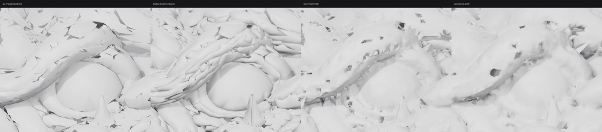

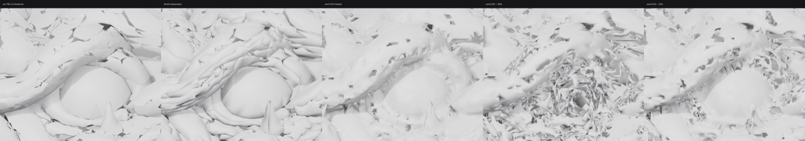

The fine-voxel result is the most informative failure. Coarse voxel removes shards because they fall *below* sampling resolution; fine voxel keeps creases but reproduces the shards as real solid geometry. **No voxel size wins both.**

We also ruled out two untried options *in advance*, to avoid adding a dependency to find out:

- **CGAL `alpha_wrap_3`** carves inward from infinity and must stay outside *every* piece of input, so it shrink-wraps *over* a floating flap rather than rejecting it. To bridge the flaps, its `alpha` must exceed the flap standoff — but that same alpha bridges the coil contacts. Identical fuse-vs-detail curve to voxel remesh.
- **ManifoldPlus** at `--depth 10` ≈ 1024³ is *finer* than the 0.002 test that rebuilt the ribbons; `--depth 8` ≈ 256³ ≈ the 0.004 test that fused them. It lands between two results already rejected.

At this point the downstream toolbox was genuinely exhausted — not underpowered, empty.

---

## 6. The measurement that changed everything

The breakthrough came from asking a different question: **is the mesh broken when it leaves the model, or does something break it afterwards?**

The pipeline writes its pre-decimation output to disk. That file was already sitting there from the very run that produced the broken asset — same seed, same settings.

| stage | faces | boundary edges | faces touching boundary |
|---|---|---|---|
| **intermediate (from raw decode)** | 1.42M | 7.5% | **9.3%** |
| **final GLB (after `to_glb`)** | 97.7K | 27.3% | **40.9%** |

**The mesh coming out of the model passes the gate.** Something in the export stage amplifies the defect 4.4×.

And rendering that intermediate settled it beyond argument — continuous coils, a clean over-and-under braid, all four hooked limbs, no ribbons anywhere:

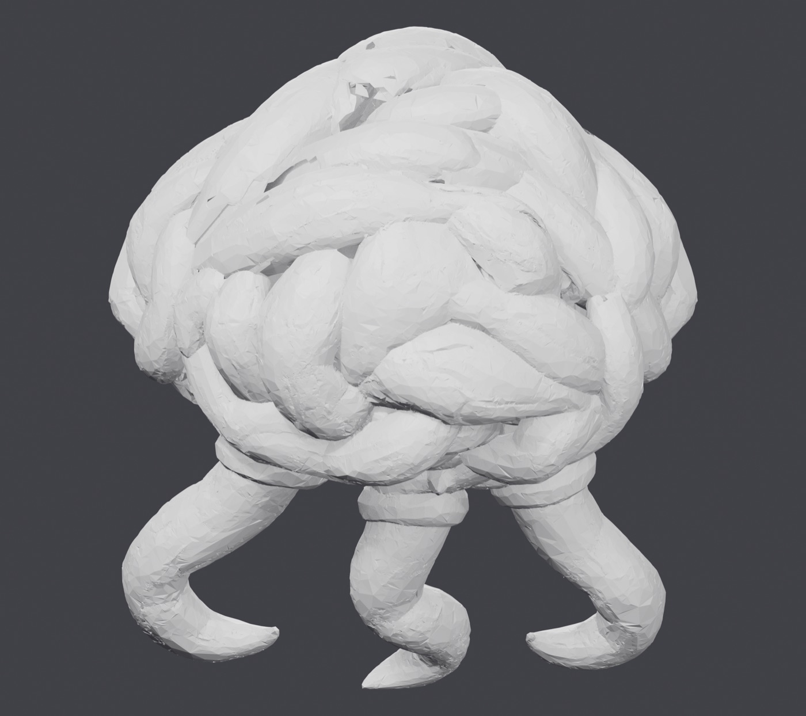

Every theory about the model — grid resolution, subject density, view ambiguity — was dead. The model had done its job.

---

## 7. Finding it: instrumenting all twelve steps

The export stage runs a twelve-step cleanup chain. We measured the metric after every single step.

| # | step | faces | boundary % | **faces touching** |
|---|---|---|---|---|
| 0 | input (`fast_simplification` output) | 1,139,706 | 8.8% | 11.5% |
| 1 | `fill_holes` | 1,140,294 | 8.7% | 11.4% |
| 2 | `simplify(target × 3)` | 290,802 | 6.4% | 7.5% |
| 3 | `remove_duplicate_faces` | 268,286 | 7.4% | 9.4% |
| 4 | `repair_non_manifold_edges` | 268,286 | 7.4% | 9.4% |
| 5 | `remove_small_connected_components` | 218,941 | 9.3% | 12.7% |
| 6 | `fill_holes` | 263,755 | 6.0% | 7.8% |
| **7** | **`simplify(target)`** | **92,243** | **29.9%** | **44.7%** ⬅ |
| 8 | `remove_duplicate_faces` | 91,412 | 31.1% | 46.0% |
| 9 | `repair_non_manifold_edges` | 91,412 | 31.1% | 46.0% |
| 10 | `remove_small_connected_components` | 90,810 | 30.5% | 45.7% |
| 11 | `fill_holes` | 92,980 | 28.8% | 43.3% |
| 12 | `unify_face_orientations` | 92,980 | 28.8% | 43.3% |

**Step 7. One step, 7.8% → 44.7%.** Everything after it is just carrying the damage forward.

But here's the confusing part: running that *exact same* `simplify` call to that *exact same* target, directly on the clean 1.14M input, gives **7.4%** — perfectly healthy. A full sweep confirmed decimation ratio was never the issue; more aggressive reduction actually *improved* the metric:

| target | result | reduction | faces touching |
|---|---|---|---|
| 800,000 | 755,748 | 1.5× | 9.1% |
| 400,000 | 395,628 | 2.9× | 7.9% |
| 200,000 | 196,576 | 5.8× | 7.3% |
| 100,000 | 97,062 | 11.7× | 7.4% |
| 50,000 | 49,085 | 23.2× | 8.1% |

So it wasn't the operation and it wasn't the ratio. **It was the state of the input.** Something in steps 1–6 was poisoning the mesh.

---

## 8. The culprit

An ablation — run the chain repeatedly, each time skipping one step:

| case | faces | duplicate verts | faces touching |
|---|---|---|---|
| REF — raw 1.14M → `simplify(100k)` | 96,868 | 0 | **7.4%** |
| **A — the real chain** | 91,994 | **18,253** | **44.8%** |
| B — weld first, then simplify | 98,482 | 0 | **8.4%** ✅ |
| C — skip `repair_non_manifold_edges` | 95,422 | 0 | **10.0%** ✅ |
| D — skip `fill_holes` only | 88,692 | 18,859 | 47.1% ❌ |
| E — skip both | 95,741 | 0 | **10.1%** ✅ |

The pattern is unmistakable. Every case with duplicate vertices is broken; every case without them is fine.

**The culprit is `repair_non_manifold_edges()`.**

Its own docstring says exactly what it does:

> *Repair Non-manifold edges by **splitting vertices**. This creates duplicate vertices with the same coordinates.*

By step 6 there were **135,662 duplicate vertices** in the mesh.

### The mechanism, in plain terms

Think of the mesh as a quilt.

There's a repair step that hunts for bad seams — spots where three or more patches meet along one edge, which confuses later tools. Its way of "repairing" them is to **cut the patches apart** there. The pieces stay in exactly the same place, so the quilt looks completely unchanged. But they are no longer stitched to each other.

The very next step simplifies the quilt by merging neighbouring patches together. **It cannot merge across a cut.** So it merges everything *except* around the cuts, and the regions around every cut get stretched and torn open as their surroundings shrink away.

135,662 cuts, then a decimation pass. That's the shredding.

---

## 9. The fix

Stitch the cuts back up immediately before simplifying.

```python
def _weld(mesh):
    vertices, faces = mesh.read()
    vn, fn = vertices.cpu().numpy(), faces.cpu().numpy()
    _, idx, inv = np.unique(vn, axis=0, return_index=True, return_inverse=True)
    nf = inv[fn]
    nf = nf[(nf[:,0] != nf[:,1]) & (nf[:,1] != nf[:,2]) & (nf[:,0] != nf[:,2])]
    mesh.init(
        torch.tensor(vn[idx], dtype=torch.float32).contiguous(),
        torch.tensor(nf,      dtype=torch.int32).contiguous(),
    )
```

Called before each `simplify()`. Use **exact** matching, not a tolerance — the repair creates bit-identical duplicates, so exact `np.unique` is both correct and safer than a distance weld.

**40.9% → 8.9%.** No regeneration, no resolution change, no new dependency, no respeccing the creature.

Left: what ships today (92K faces, 43.5% torn). Right: the identical chain with the weld added (98K faces, 8.9% torn). Same camera, same lights, flat-shaded so the tearing is visible.

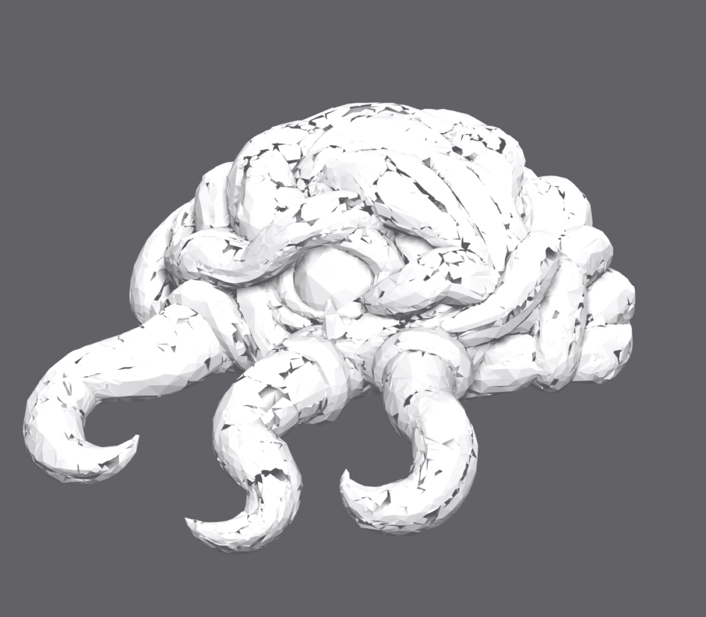
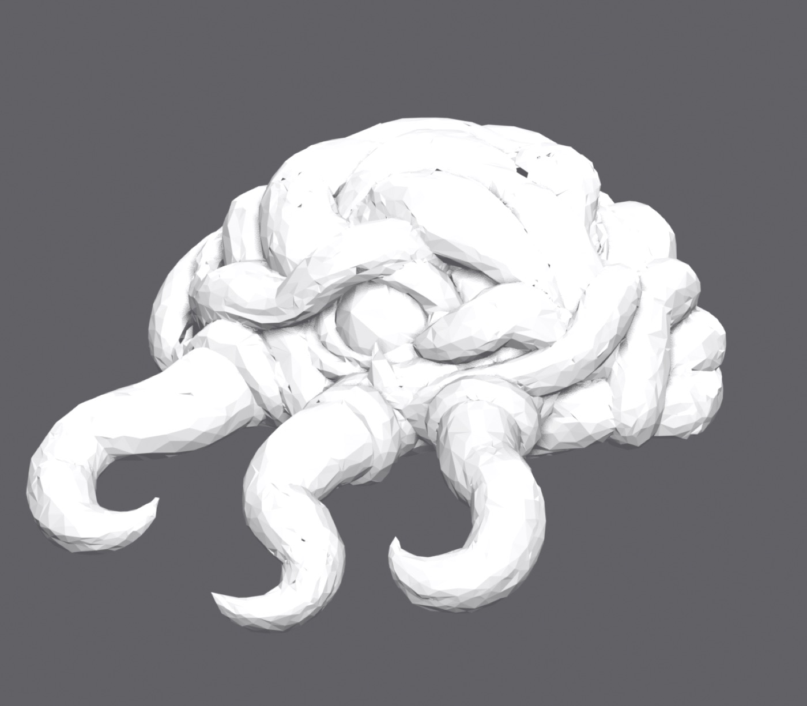

### One scoping trap worth knowing

The weld **must** be a separate function. The export stage captures `vertices, faces` early and still uses them at the very end, to map texture positions back onto the original high-resolution mesh:

```python
_, face_id, uvw = bvh.unsigned_distance(valid_pos, return_uvw=True)
orig_tri_verts = vertices[faces[face_id.long()]]
```

Inlining `vertices, faces = mesh.read()` into the body would silently rebind those names and scramble every texture — and it would look like a texturing bug, not a scoping bug.

---

## 10. The twist: more triangles made it worse

With the fix in, the obvious next move was to raise the triangle budget. The cap was 200,000, justified in a code comment as avoiding a crash that we'd already measured as no longer reproducing. Free win, surely.

No. Rendered **flat-shaded**, the high-poly meshes look better. Rendered **smooth-shaded** — which is what actually ships — the ranking completely inverts:

| mesh | faces | score | smooth-shaded verdict |
|---|---|---|---|
| weld fix @ 100k | 98,298 | 8.9% | clean, continuous coils — **best by a wide margin** |
| weld fix @ 400k | 392,221 | 8.8% | speckled with small dark nicks everywhere |
| raw decode | 1,139,706 | 11.5% | a mass of glittery shattered facets — unusable |

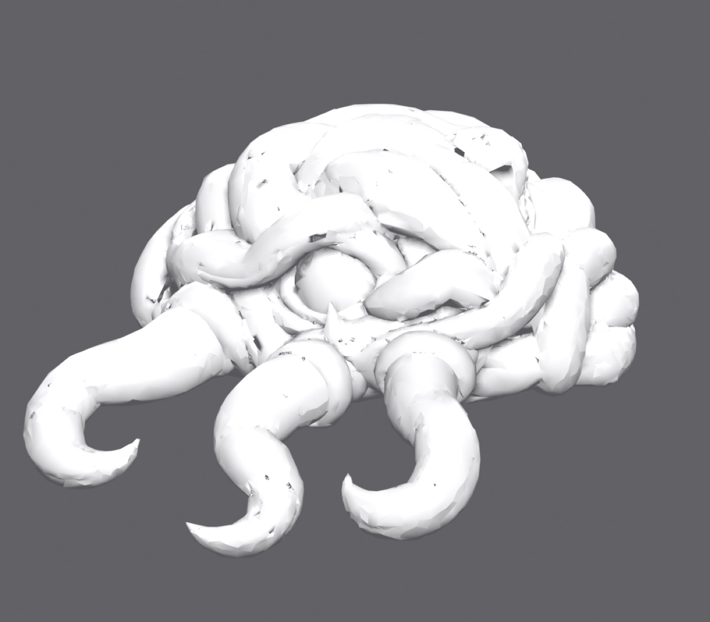
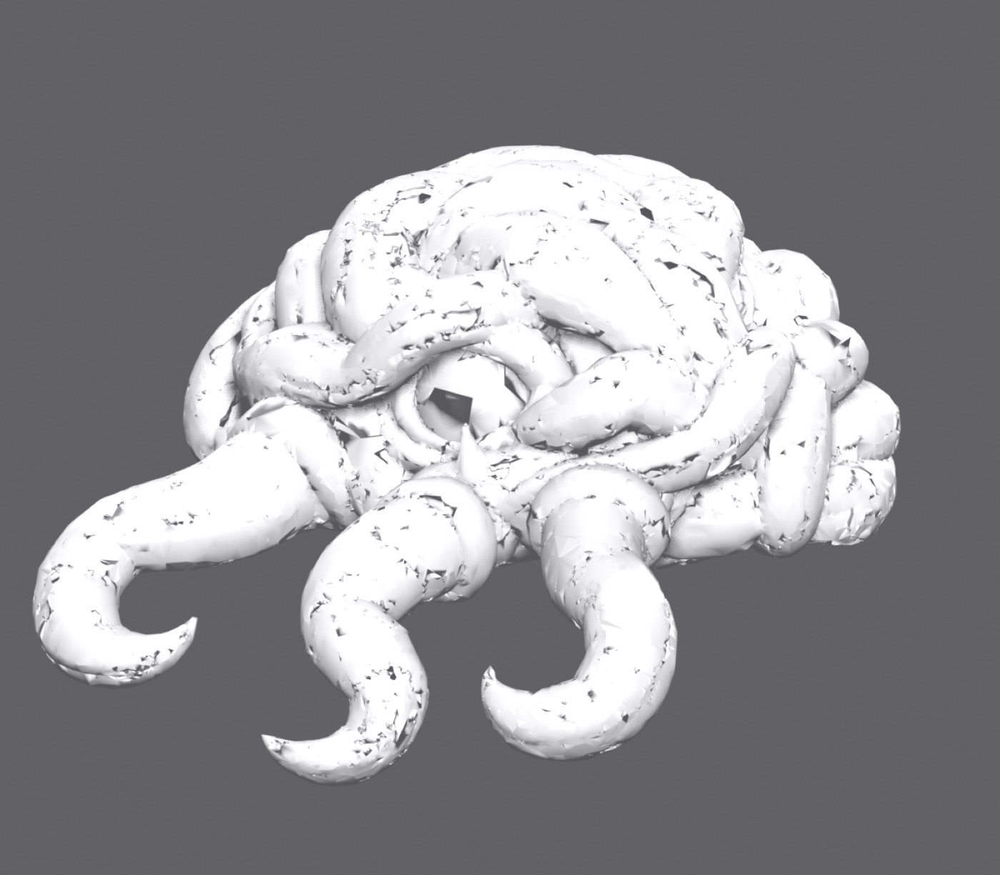
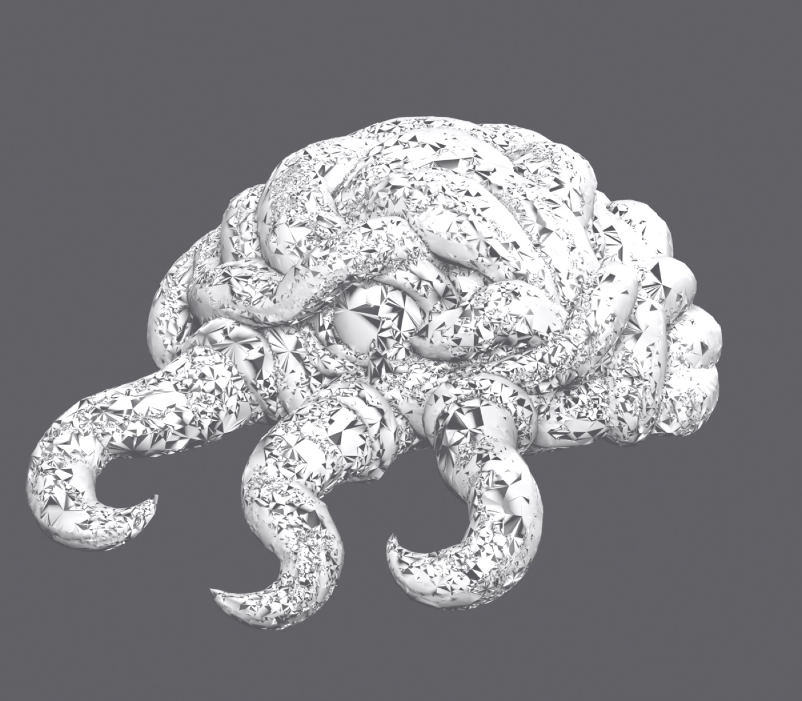

**Decimation is not just a size budget — it is doing essential cleanup.** At high face counts the residual tears survive as many small holes spread everywhere; decimation consolidates and removes them. More faces preserves more damage.

A corollary worth writing down: **the raw decode is not a better master to finish from.** "Skip the decimation and work from the high-poly" produces the worst of the three.

---

## 11. Why it hid for two days

Three reasons, and all three are reusable lessons.

### The metric welded away the defect it was built to find

The tear metric merges coincident vertices before counting — normally correct, since imported files split vertices at texture seams. But `repair_non_manifold_edges` creates duplicates at *identical coordinates*, so welding stitched the cuts back up before counting them.

The mesh scored healthy at every step **right up to the moment it was destroyed.** The one measurement built to detect this damage was structurally incapable of seeing its cause.

### The metric isn't comparable across face counts

392K scored 8.8% and 98K scored 8.9% — statistically identical, visually nothing alike. The metric measures the *proportion* of faces touching a boundary, not how visible the resulting holes are. The same proportion spread across four times the faces is many small holes instead of a few consolidated ones.

This is more dangerous than the SF3D case, because nothing about the number looks wrong.

### Rendering mode changes the verdict

Flat shading gives each face its own normal, so tears read as mild creases — it **flatters** a torn mesh. Smooth shading interpolates across the tear and produces chaotic glitter — it **punishes** one.

Flat is right for diagnosis and wrong for judging shippability. Rendering flat and then reading the result as "which mesh is best" cost a full round of wrong advice.

---

## 12. Side findings

Things established along the way that turned out to be true but not the answer:

- **The Metal `cumesh` segfault does not reproduce.** The port stubs out several cleanup functions with the comment *"Metal cumesh segfaults on large decode meshes."* Probing every operation in isolated subprocesses: clean on a synthetic mesh at 655k verts, clean on the real shattered mesh, and the full four-stage chain completes at **764k verts / 1.47M faces in 4.59 seconds**. The warning predates the current Metal backend. *(Caveat: probed in isolation, not during a live decode with the diffusion model resident in memory.)*
- **The stubs aren't where the docs said.** They're on `trellis2/representations/mesh/base.py`, a wrapper class — not on `cumesh`, whose cleanup chain runs normally.
- **`remove_faces` is never called by anything.** It's a deletion primitive that takes a caller-supplied mask; nothing in the tree supplies one. TRELLIS.2 has no visibility cull at all, in either the CUDA or Metal path — the ~1000-camera version is TRELLIS **v1** only.
- **`remove_small_connected_components(1e-5)` removes exactly zero faces** on this mesh — 209,466 in, 209,466 out. It runs, it isn't stubbed, and the shards are all above its threshold.

---

## 13. What actually made the difference

Three hypotheses in a row were wrong — two mine, one the other agent's. Each was killed in **seconds** by a cheap measurement rather than by a long run:

- "Too dense for the model" → killed by measuring the intermediate (already on disk).
- "Decimation ratio is too aggressive" → killed by a five-point sweep (under a minute).
- "The blockout grid is too coarse" → killed by the same intermediate measurement.

Meanwhile the two most expensive things attempted — building a full visibility cull with tests, and a 16-minute regeneration at a higher triangle budget — both produced nothing.

**The ratio of insight-per-minute between "measure the thing you already have" and "run the expensive experiment" was roughly a thousand to one.**

---

## 14. Practices adopted

1. **Gate on the tear metric.** Reject any decode above ~10% faces-touching-boundary before spending a minute on finishing. Never use it to *accept* — it catches tearing, not fidelity.
2. **Measure the intermediate, not just the shipped asset.** Had this been in place, day one would have read "decode healthy, export broken" instead of "the model can't do this creature."
3. **Check what your metric normalises away.** Ours welded. Ask what yours quietly repairs before it counts.
4. **Judge on smooth shading; diagnose on flat.** Never mix them up.
5. **"No crash" ≠ "correct output."** An early probe reported `simplify` returning cleanly in 0.74s and concluded the code was healthy. It never checked whether the output was shredded.
6. **Don't raise the triangle budget to fix quality.** On a damaged mesh, decimation is repair.

---

## Appendix: the fix in one line of prose

> `repair_non_manifold_edges()` splits vertices into exact duplicates; QEM edge collapse cannot collapse across them, so the next `simplify()` tears the surface open at every seam. Weld before simplifying.
